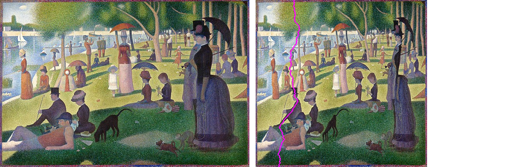

# Seam Carving 
This repository contains the code for implemntation of the Paper on [Image Resizing by Seam Carving](http://www.cs.cmu.edu/afs/andrew/scs/cs/15-463/f07/proj2/www/wwedler/#:~:text=Seam%20carving%20allows%20a%20change,image%20and%20removing%20those%20paths.). 
# Intuition
The algorithm ommits the deadspace inside the picture on shrinking it, without changing the objects inside the picture. The jist behind the algorithm is to detect the edges and remove a path (the path is one pixel wide) from top of the image to bottom, the removed pixels are the one which have similar surroudings. So, that the deletion of those pixels can be overlooked by human eye.

On the left is the original image, and on the right is the same image when compressed by half.The purple line you see in the shrinked image is nothing but the "Seam" upon shrinking further the pixels on that purple line will get deleted.
