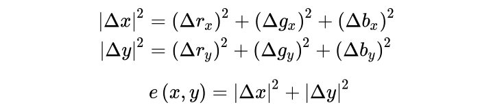
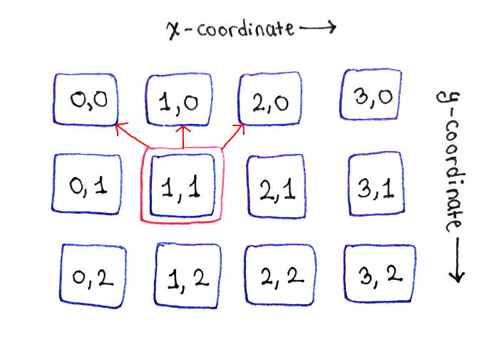
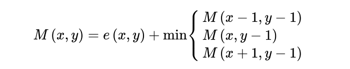

# Seam Carving 
This repository contains the code for implemntation of the Paper on [Image Resizing by Seam Carving](http://www.cs.cmu.edu/afs/andrew/scs/cs/15-463/f07/proj2/www/wwedler/#:~:text=Seam%20carving%20allows%20a%20change,image%20and%20removing%20those%20paths.). 
# Intuition
The algorithm ommits the deadspace inside the picture on shrinking it, without changing the objects inside the picture. The jist behind the algorithm is to detect the edges and remove a path (the path is one pixel wide) from top of the image to bottom, the removed pixels are the one which have similar surroudings. So, that the deletion of those pixels can be overlooked by human eye.

On the left is the original image, and on the right is the same image when compressed by half.The purple line you see in the shrinked image is nothing but the "Seam" upon shrinking further the pixels on that purple line will get deleted.
# The fancy part -  *Dynamic Programming*
All that is to be done is to find the energy of lowest seam every time and delete it consecutively. For this every pixel is to be assigned with some energy, what do I mean when I say energy of a pixel is the squared difference between the R,G,B components of the adjacent pixels in X and Y axis, the energy e(x,y) is

There are various methods of defining energy of a pixel the one I'm using in code is not this one but using Sobel kernel (I found it to be better performing).
The edge cases of finding the energy will be when we actually are at a pixel which is on the edge.In that case we don't consider the pixel which falls of the dimensions of the picture.
Now, to calculate the Seam path, we look up at the pixels in the above row we can connect with

Energy of the lowest-energy seam ending at a pixel M(x,y) is defined as

Base case for the recurrance is 

